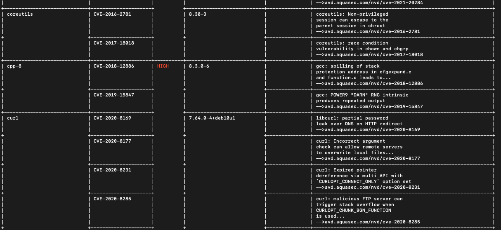
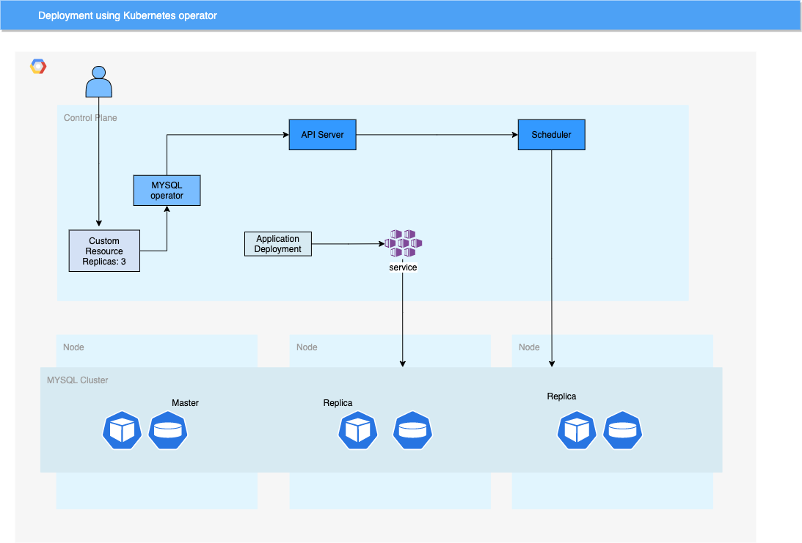

# Flask application using containers

## Approach 1: Using Docker Compose

### Image Deployment
For deployment using docker, secrets can be injected in to VM as environment variables and use them to log in to private
registries(AWS and GCP provide custom solutions for saving the credentials)

For kubernetes image pull secrets can be used for accessing stored credentials and registry details.

### Security

#### Using USER option in Dockerfile

Allows to run programs inside container as a non-root user. This allows to mitigate issues with vulnerabilites in the application.

- File system access will be non-root
- Modifying container as root not possible(installing/modifying files)

#### Using userns-mapping
userns-mapping allows to map uid and gid used inside container to another set of uid and gid on the host machine.
Without userns-mapping mapping of id inside container and outside host are identical. 

- In case of volume mounting, files creating on the shared volumes will be with uid less privileged than on host
- In case container is compromised, maximum privilege on host is limited to mapping 
 
#### Scan for vulnerabilities

[Trivy](https://github.com/aquasecurity/trivy#installation) is simple and Comprehensive Vulnerability Scanner for Containers and other Artifacts, Suitable for CI.

#### Dockerfile linting using Hadolint

[Hadolint](https://github.com/hadolint/hadolint) helps to implement best practices in Dockerfiles.

## Approach 2: Using Managed MySQL

Cloud providers such AWS, GCP and Azure provide managed relation database systems. Using these services
- Provides easy scalability with Datacenters across different regions
- Tools for backup and restore

## Approach 3: Using Kubernetes

Another approach to use Kubernetes to run Flask application and MYSQL cluster using MYSQL kubernetes operator
using Persistent volumes.

Example deployment diagram below

