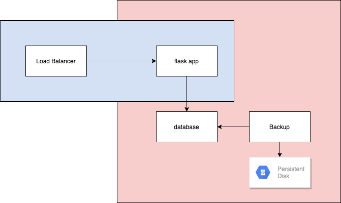

# Flask application using containers

## Approach 1: Using Docker Compose

### Security

#### Using USER option in Dockerfile

Allows to run programs inside container as a non-root user. This allows to mitigate issues with vulnerabilites in the application.

- File system access will be non-root
- Modifying container as root not possible(installing/modifying files)

#### Using userns-mapping
userns-mapping allows to map uid and gid used inside container to another set of uid and gid on the host machine.
Without userns-mapping mapping of id inside container and outside host are identical. 

- In case of volume mounting, files creating on the shared volumes will be with uid less privileged than on host
- In case container is compromised, maximum privilege on host is limited to mapping 
 
#### Dockerfile linting using Hadolint

[Hadolint](https://github.com/hadolint/hadolint) helps to implement best practices in Dockerfiles.

## Approach 2: Using Kubernetes

### Deployment files for Flask App
### Deployment files for MySql operator
#### PV for operator
### Service for Flask and MySql operator

